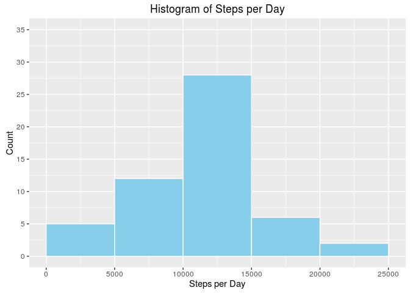
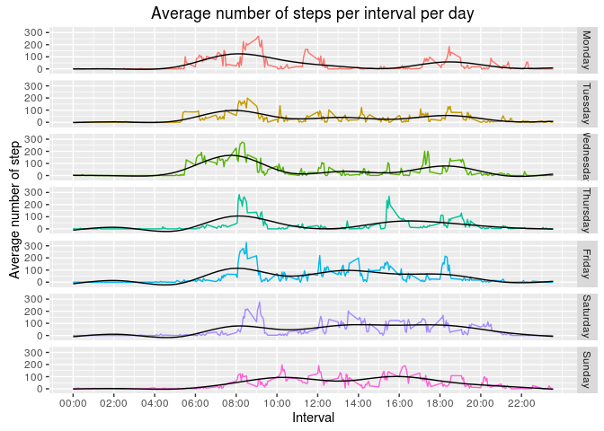

# Reproducible Research: Peer Assessment 1
Valter Beaković  
January 8, 2016  
#### **Note**
**Use rmarkdown::render("PA1_template.Rmd") to knit the md and html files when reproducing the research!**

Set locale to English (default is Croatian on the PC used to produce the document)

```r
Sys.setlocale("LC_ALL", "en_GB.UTF-8")
```
The R code uses functions from various libraries. The code bellow installs and loads the 
required libraries.

```r
packages <- c("ggplot2", "dplyr", "lubridate")
if (length(setdiff(packages, rownames(installed.packages()))) > 0) {
  install.packages(setdiff(packages, rownames(installed.packages())))  
}
library(dplyr)
library(ggplot2)
library(lubridate)
```


## Loading and preprocessing the data
The data used for the research comes from a personal activity monitoring device. 
It includes two months of data, October and November 2012. The dataset is in the 
./data folder stored as an archive file activity.zip

The first step is to extract the csv file containing the activitiy data from the
archive.

```r
if (file.exists("./data/activity.zip")) {
        unzip("./data/activity.zip", exdir = "data")   
}
```

The code bellow loads the activity data into a data frame:

```r
if (file.exists("./data/activity.csv")) {
        activity_data <- read.csv("./data/activity.csv")                
}
```

The data set cointains three variables:

* steps: Number of steps taking in a 5-minute interval (missing values are coded as NA)
* date: The date on which the measurement was taken in YYYY-MM-DD format
* interval: Identifier for the 5-minute interval in which measurement was taken

The data set has 17568 observations:

```r
str(activity_data)
```

```
## 'data.frame':	17568 obs. of  3 variables:
##  $ steps   : int  NA NA NA NA NA NA NA NA NA NA ...
##  $ date    : Factor w/ 61 levels "2012-10-01","2012-10-02",..: 1 1 1 1 1 1 1 1 1 1 ...
##  $ interval: int  0 5 10 15 20 25 30 35 40 45 ...
```

Of the three variables only the date has been transformed from character to date
format:

```r
activity_data$date <- as.Date(as.character(activity_data$date), "%Y-%m-%d")
```

## What is mean total number of steps taken per day?

By grouping the observations by day and summing up the total number  of steps per 
interval the a total number of steps per day are calculated:

```r
# select only rows not containg missing observations
activity_data_cc <- activity_data[complete.cases(activity_data), ]
activity_data_cc_steps_day <- group_by(activity_data_cc, date) %>% 
        summarise(total_steps_day = as.integer(round(sum(steps))))
```

Histogram of steps per day:

```r
ggplot(data = activity_data_cc_steps_day, aes(x = total_steps_day)) + 
        geom_histogram(breaks = seq(0, 25000, by = 5000), color = "white", fill = "skyblue") + 
        scale_x_continuous(limits = c(-0, 25000)) + 
        scale_y_continuous(limits = c(0, 35), breaks = seq(0, 35, 5)) +  
        ggtitle("Histogram of Steps per Day") + 
        xlab("Steps per Day") + 
        ylab("Count")
```

 

The mean of steps per day is:

```r
as.integer(round(mean(activity_data_cc_steps_day$total_steps_day)))
```

```
## [1] 10766
```

The median of steps per day is:

```r
as.integer(round(median(activity_data_cc_steps_day$total_steps_day)))
```

```
## [1] 10765
```

## What is the average daily activity pattern?
By grouping the observations by interval and averaging the number of steps per 
interval a time series plot showing 5-minutes interval (x-axis) and the average 
number of steps taken (y-axis) is created

```r
# average steps per interval
activity_data_cc_interval_avg <- group_by(activity_data_cc, interval) %>%
        summarise(interval_avg = as.integer(round(mean(steps))))
# a bit of work to have a nicer x axis
x_interval_labels <- as.character(activity_data_cc_interval_avg$interval)
x_interval_labels <- sub("(^\\d$){1}", "00:0\\1" , x_interval_labels)
x_interval_labels <- sub("(^\\d\\d$){1}", "00:\\1" , x_interval_labels)
x_interval_labels <- sub("(^\\d)(\\d\\d$){1}", "0\\1:\\2" , x_interval_labels)
x_interval_labels <- sub("(^\\d\\d)(\\d\\d$){1}", "\\1:\\2" , x_interval_labels)
x_interval_labels <- x_interval_labels[seq(1, length(x_interval_labels), 24)]
x_interval <- activity_data_cc_interval_avg$interval[
        seq(1,length(activity_data_cc_interval_avg$interval),  24)]

# time series plotting 
ggplot(data = activity_data_cc_interval_avg, aes(x = interval, y = interval_avg)) + 
        geom_line(color = "#1b9e77") +
        scale_x_continuous(labels = x_interval_labels, breaks = x_interval) + 
        ggtitle("Average number of steps per interval") + 
        xlab("Interval") + 
        ylab("Average number of step")
```

 

Finding the interval with the maximum average number of steps:

```r
# Interval with maximum average number of steps
activity_data_cc_interval_avg$interval[
        which.max(activity_data_cc_interval_avg$interval_avg)]
```

```
## [1] 835
```

```r
# Maximum average number of steps in interval
activity_data_cc_interval_avg$interval_avg[
        which.max(activity_data_cc_interval_avg$interval_avg)]
```

```
## [1] 206
```


## Imputing missing values

Checking missing values per variable type:

Missing values in variable "steps":

```r
sum(is.na(activity_data$steps))
```

```
## [1] 2304
```

Missing values in variable "date":

```r
sum(is.na(activity_data$date))
```

```
## [1] 0
```

Missing values in variable "interval":

```r
sum(is.na(activity_data$interval))
```

```
## [1] 0
```

Checking complete cases:

```r
sum(is.na(activity_data))
```

```
## [1] 2304
```

From the result above it is clear that only the variable "steps" has missing 
values and an imputing strategy has to be defined to fill in missing values.
To select an imputing strategy a panel plot showing average number of steps per
interval per each day of week. The panel plot is produced using only complete 
cases.

```r
# adding a variable defining day of week

activity_data_cc$weekday <- as.factor(weekdays(activity_data_cc$date))
activity_data_cc$weekday <- factor(activity_data_cc$weekday, 
                                   levels= c("Monday", 
                                             "Tuesday", 
                                             "Wednesday", 
                                             "Thursday", 
                                             "Friday", 
                                             "Saturday", 
                                             "Sunday"))
# calcultation of average number of steps per interval and per day of week
activity_data_cc_day_int <- group_by(activity_data_cc, weekday, interval) %>% 
        summarise(day_int_avg = mean(steps))
ggplot(data = activity_data_cc_day_int, 
       aes(x = interval, y = day_int_avg, color = weekday)) + 
        geom_line() + stat_smooth(se = FALSE, color = "black", size = 0.5) + 
        facet_grid(facets = weekday ~ .) + 
        scale_x_continuous(labels = x_interval_labels, breaks = x_interval) + 
        ggtitle("Average number of steps per interval per day") + 
        xlab("Interval") + 
        ylab("Average number of step") + 
        theme(legend.position = "none")
```

 

From the panel plot it looks like Monday, Tuesday, Wednesday and Thursday have a somewhat similar pattern, Friday and Staurday have similar patterns while Sunday has a pattern of its own. From the plot a feasible imputing strategy could be to replace the missing values of steps with the average number of steps in the corresponding interval and for the same day. This strategy will be used the impute the missing values:

```r
# imouting mising values with the average of the same interval and same day as missing value
activity_data_na <- activity_data[!complete.cases(activity_data), ]
for (i in seq_along(activity_data_na$steps)) {
        activity_data_na$steps[i] <- activity_data_cc_day_int$day_int_avg[
                activity_data_cc_day_int$interval == activity_data_na$interval[i] & 
                        activity_data_cc_day_int$weekday == weekdays(activity_data_na$date[i])]
}
# merge data frame with complete cases and data frame with imputed values, 
# after merging sorting by date and interval
activity_data_imp <- rbind(activity_data_cc[-4], activity_data_na)
activity_data_imp <- arrange(activity_data_imp, date, interval)
```

By grouping the observations with imputed values by day and summing up the total number  of steps per 
interval the a total number of steps per day are calculated:

```r
activity_data_imp_steps_day <- group_by(activity_data_imp, date) %>% 
        summarise(total_steps_day = as.integer(round(sum(steps))))
```

Histogram of steps per day:

```r
ggplot(data = activity_data_imp_steps_day, aes(x = total_steps_day)) + 
        geom_histogram(breaks = seq(0, 25000, by = 5000), color = "white", fill = "skyblue") +  
        scale_x_continuous(limits = c(0, 25000)) + 
        scale_y_continuous(limits = c(0, 35), breaks = seq(0, 35, 5)) +  
        ggtitle("Histogram of Steps per Day with Imputed Values") + 
        xlab("Steps per Day") + 
        ylab("Count")
```

 

The mean of steps per day with imputed values is:

```r
as.integer(round(mean(activity_data_imp_steps_day$total_steps_day)))
```

```
## [1] 10821
```

The median of steps per day with imputed values is:

```r
as.integer(round(median(activity_data_imp_steps_day$total_steps_day)))
```

```
## [1] 11015
```

The selected imputing strategy resulted in an increase of both the mean and the meadian number of steps. The mean number of steps per day increased from 10776 to 10821 steps while the median number of steps increased from 10765 to 11015 steps.


## Are there differences in activity patterns between weekdays and weekends?

By creating a variable that identifies weekends or weekdays and additionally grouping the data by interval a time series panel plot is produced displaying number of steps per interval faceted by week part.

```r
activity_data_imp$week_part <- ifelse(weekdays(activity_data_imp$date) %in% 
                                              c("Saturday", "Sunday"), "Weekend", "Weekday")
activity_data_imp$week_part <- as.factor(activity_data_imp$week_part)
activity_data_imp_int_week <- group_by(activity_data_imp, interval, week_part) %>% 
        summarise(avg_steps = mean(steps))

ggplot(data = activity_data_imp_int_week, aes(x = interval, y = avg_steps, color = week_part)) + 
        geom_line() + facet_grid(facets = week_part ~ .) + 
        scale_x_continuous(labels = x_interval_labels, breaks = x_interval) + 
        ggtitle("Time series of average number of steps per interval 
                \n divided part of week (weekend or weekday)") + 
        xlab("Interval") + 
        ylab("Average number of steps per interval") + 
        theme(legend.position = "none")
```

 

From the panel plot it may be noted that there are differnces in the activity patterns between weekdays and weekends. During weekdays the maximum average numer of steps is above 200 while the maxiumum average number of steps during weekends is below 200. Both maximums occur between 8 and 10 AM. Activities during weekends start about 2 horus later. It is also noticable that during weekends the average number of steps after 10:00AM is higher than during weekdays and that activities stop about an hour later.
